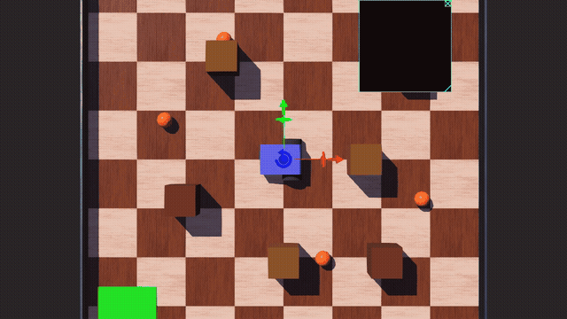

https://github.com/DmytroZavhorodnii/webots-garbage-collector
# Webots Garbage Collector Robot

Robot zbierający śmieci zaimplementowany w symulatorze **Webots R2025a** w języku C.



## Opis

Robot autonomicznie zbiera 5 obiektów (śmieci) rozrzuconych po arenie 2×2m i dostarcza je do bazy w rogu, omijając 6 przeszkód.

## Algorytmy

### Sterownik P (kinematyka różniczkowa)

Dwukołowy robot różniczkowy sterowany proporcjonalnym regulatorem P:

```
ε₁ = ||pos - cel||          (błąd odległości)
ε₂ = φ* - θ                 (błąd kąta)
u₁ = Kp₁ · ε₁               (prędkość liniowa)
u₂ = Kp₂ · ε₂               (prędkość kątowa)
ω_L = (u₁ - r·u₂) / R
ω_R = (u₁ + r·u₂) / R
```

Parametry: `Kp₁=2.0`, `Kp₂=5.0`, `R=0.05m`, `r=0.09m`

### Agent wnioskujący (reguły reaktywne)

```
W(x,y) ∧ O(x,y)  →  Wykonaj(usuń)           # robot przy śmieciu → zbierz
¬zebrany(i) ∧ min_dist  →  Wykonaj(jedź_do)  # wybierz najbliższy
przeszkoda_z_przodu  →  Wykonaj(obrót)       # warstwa reaktywna
```

### Warstwa reaktywna — unikanie przeszkód

Potencjały odpychające modyfikują sterowanie gdy przedni sensor wykrywa przeszkodę < 0.20m:

```c
closeness = (OBS_FRONT - dist_c) / OBS_FRONT
u2 += turn_dir * 4.0 * closeness    // skręć w wolną stronę
u1 *= max(0.2, 1.0 - closeness)     // zwolnij
```

## Maszyna stanów

```
SELECT → GO_TO_GARBAGE → PICK → BACK_UP → GO_TO_BASE → DEPOSIT → SELECT → ...
                                                                       ↓ (5/5)
                                                                      DONE
```

## Środowisko

| Element | Opis |
|---|---|
| Arena | 2×2m, ściany na ±1m |
| Śmieci | 5 kulek (r=4cm), fizyka aktywna |
| Przeszkody | 6 brązowych sześcianów 15×15×20cm |
| Baza | Zielony kafelek 30×30cm w rogu (-0.8, -0.8) |

## Robot

- **Napęd**: różniczkowy, 2 koła (R=5cm, rozstaw=18cm)
- **Sensory**: 3× DistanceSensor z przodu (±0.3 rad), GPS, Compass
- **Display**: mapa 320×320px z pozycją robota, śmieciami i promieniami sensorów
- **API Supervisor**: teleportacja zebranych śmieci

## Uruchomienie

```bash
# Wymaga Webots R2025a
webots worlds/garbage_collector.wbt
```

Kontroler kompiluje się automatycznie przy starcie Webots, lub ręcznie:

```bash
cd controllers/zbieracz_rl_v4
gcc -o zbieracz_rl_v4 zbieracz_rl_v4.c \
    -I/usr/local/webots/include/controller/c \
    -L/usr/local/webots/lib/controller -lController -lm
```

## Struktura projektu

```
.
├── worlds/
│   └── garbage_collector.wbt       # definicja świata
├── controllers/
│   └── zbieracz_rl_v4/
│       └── zbieracz_rl_v4.c        # kontroler robota
├── garbage_collector.gif           # demo symulacji
└── README.md
```
